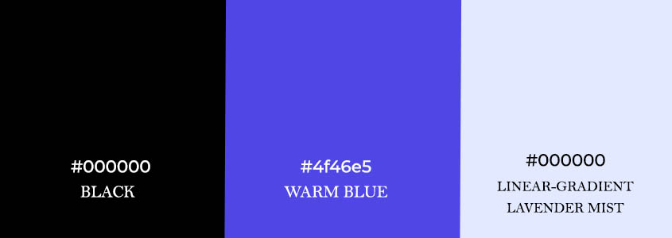

# Memory Card Game Website
 
Project by: Iyeme Salubi 

[View live github project](https://iyeme-dev.github.io/memory-card-game/)

This project creates an interactive game designed to challenge and improve users’ memory and concentration skills. The primary goal of the project is to provide a fun, engaging, and accessible gaming experience for users of all ages, while also offering a clean and intuitive interface that is easy to navigate.

# Table of Contents

1. [About the Memory Card Game](#about-the-memory-card-game)
2. [User Experience UX](#user-experience-ux)
   - [User Stories](#user-stories) 
3. [Rationale](#rationale)
   - [Target Audience](#target-audience)
   - [Background](#background) 
   - [Motivation](#motivation)    
   - [Proposed Solution](#proposed-solution)
   - [Why This Game Stands Out](#why-this-game-stands-out)  
   - [Overall Improvements Over Current Alternatives](#overall-improvements-over-current-alternatives)  
   - [Project Scope and Limitations](#project-scope-and-limitations)  
   - [Future Improvements](#future-improvements)  
   - [Summary](#summary)  
4. [Design](#design)
   - [Brand Colours](#brand-colours)
   - [Typography](#typography)  
   - [Layout & Structure](#layout-and-structure)  
   - [Wireframe](#wireframe)  
5. [Deployment](#deployment)
6. [Testing](#testing)
   - [Browser Testing](#browser-testing)
   - [Functionality Testing](#functionality-testing)  
   - [Code Validation](#code-validation)  
   - [Lighthouse Test](#lighthouse-test)
7. [Testing Errors and Improvements](testing-errors-and-improvements)
8. [Technologies Used](#technologies-used)
9. [Credit and Reference](credit-and-reference)
10. [Author](author)

# About the Memory Card Game 
The game features a clean, responsive design. Players are presented with a set of cards placed face down, and the objective is to match pairs by remembering the position of each card. The game includes features such as a countdown timer, restart button, instructional guidance, and feedback popups for both wins and losses, creating a responsive and rewarding user experience. 

# User Experience UX
The game has been designed with a primary focus on the following set of users - Game Lovers who enjoy challenges that test memory and concentration, Teachers & Parents seeking an engaging, simple game for children that can help improve memory while keeping them entertained, Students who want to practice focus and short-term memory skills and Busy Professionals looking for a short, stress-relieving break during work hours. 

## User Stories
- **Quick and Easy to Start:** As a busy professional, I want to quickly start a game without needing to sign up, so I can maximize my break time.
- **Mobile Responsiveness:** As a game lover, I want the game to function properly on my phone, so I can play on the go.
- **Restart Button:** As a game lover, I want to quickly restart the game with a single click, so that I can replay immediately if I make a mistake or want a new challenge without having to refresh the whole page.
- **Instruction Tab:** As a game lover, I want to easily access clear instructions on how to play, so that I can understand the objectives, controls, and rules before starting the game.
- **You Win Popup:** As a game lover, I want to receive feedback when I successfully match all cards, so that I feel encouraged after completing the challenge and motivated to play again.
- **Simple and Fun:** As a teacher, I want a simple and fun game for children, so they stay engaged.
- **Uncluttered Layout:** As a game lover, I want the game interface to be clean and minimal, showing only essential elements— so that I can focus on the game without distractions or confusion.

# Rationale
The Memory Card Game is a simple matching game that challenges players to flip and match pairs of cards within a 60-second time limit. With just a tap, users can start the game, flip cards, and attempt to find all matching pairs before the time runs out. Clean and uncluttered, the game’s simple interface ensures both children and adults can enjoy a playful brain exercise without distractions. 

## Target Audience
- **Puzzle & Brain Game Lovers:** Users who enjoy challenges that test memory and concentration.
- **Teachers & Parents:** Those seeking an engaging, simple game for children that can help improve their memory while keeping them entertained.
- **Students:** People who want to practice focus and short-term memory skills.
- **Busy Professionals:** Users looking for a short, stress-relieving break during work hours.

## Background
Memory card games have long been used as a tool for improving cognitive skills, such as concentration, attention, and memory retention. With the rise of digital platforms, these traditional games have transitioned into interactive web applications, offering greater accessibility and engagement. However, there have been issues with responsiveness and ease of use.  This project seeks to solve this issue by creating a responsive and user-friendly experience.

## Motivation  
During development, we observed several frustrations that users often encounter when playing games online. This motivated us in the development of this game and designing it to meet certain user requirements. 
By understanding these pain points, we shaped the **Memory Card Game** to be user-friendly, intuitive, and enjoyable for everyone.  

### What We Observed & How We Responded 
We identified several challenges that players often face and we responded with some **Proposed Solutions**

- **Games that take too long to start**  
  Many users disliked the registration and login steps before playing.  
  → *We removed all barriers to entry. The game starts instantly with a single click—no sign-up required.*  

- **Lack of mobile responsiveness**  
  Players reported frustration when games weren’t optimized for phones or tablets.  
  → *We designed a fully responsive layout, ensuring smooth play on any device, whether on the go or at home.*  

- **Inconvenient restarts**  
  Users grew impatient when forced to refresh the page to replay.  
  → *We added a clear restart button and end-game popups, making it effortless to try again.*  

- **Confusion without clear instructions**  
  Some players felt lost when rules weren’t explained, often abandoning the game early.  
  → *We implemented an easy-to-access instructions tab with step-by-step guidance.*  

- **Lack of positive feedback**  
  Without encouragement, players felt less motivated to continue.  
  → *We incorporated celebratory effects such as a confetti animation and win popups, along with gentle “Game Over” prompts.*  

- **Complexity discourages children**  
  Young players struggled with games that were too complicated.  
  → *We simplified the mechanics: flip, match, and win — easy enough for kids, but still fun for adults.*  

- **Cluttered layouts distract users**  
  Overly busy interfaces often distract players from the main game.  
  → *We chose a clean, minimal design that emphasizes the cards and game flow without unnecessary clutter.*  

By considering the needs of users during the design process, we built a game that is fun, simple, and engaging. It offers clear instructions, restart functionality, and instant feedback on wins or losses. The goal is to deliver a clean, interactive, and accessible game experience for both children and adults.

## Proposed Solution
The response to the observations above was implemented using some key features and functionalities. 

### Key Features and Functionalities

- **Clear Instructions Tab:** Users can quickly understand how to play without confusion.
- **Restart Button:** Allows users to reset the game instantly, without having to reload the whole page.
- **Countdown Timer:** Adds a challenge element and motivates users to improve their speed.
- **Win and Game-Over Popups:** Provides immediate feedback when a game is completed or lost, enhancing user satisfaction.
- **Simple and Uncluttered Layout:** The interface is visually clean and responsive, making it accessible on both desktops and mobile devices.
- **Fun and Engaging Design:** The game is designed for all ages, with a focus on interactivity and fun.

By combining user-centered design with responsive functionality, this project offers a more intuitive and rewarding  memory game experience compared to typical online alternatives.

## Why This Game Stands Out
This memory game website stands out due to its simple and intuitive design, making it accessible for both children and adults. It provides interactive feedback, such as “You Win” and game-over popups, creating an engaging user experience. Features like the countdown timer, restart button, and instruction tab ensure players have clear guidance and control over their gameplay. Additionally, the site is fully responsive, ensuring a smooth experience across desktops, tablets, and mobile devices. By combining educational value with fun gameplay, it offers a unique blend of learning and entertainment.
By addressing common pain points and offering a user-focused experience, the project improves engagement, accessibility, and overall enjoyment compared to existing alternatives.

## Overall Improvements Over Current Alternatives

The Memory Card Game distinguishes itself from existing online memory games through several key enhancements:

- Intuitive User Interface: Unlike some alternatives that may have cluttered or complex interfaces, this game offers a clean, minimalist design, ensuring players of all ages can easily navigate and enjoy the game.

- Immediate Feedback Mechanisms: While many games provide limited or delayed feedback, this game delivers instant responses upon winning or losing, enhancing user engagement and satisfaction.

- Responsive Design: Ensuring accessibility across various devices, the game adapts to different screen sizes, providing a consistent experience whether on desktop or mobile.

- User-Centric Features: Incorporating elements like a countdown timer, restart button, and clear instructions, the game prioritizes user experience, making it both enjoyable and educational.

These improvements collectively offer a more engaging, accessible, and user-friendly experience compared to many existing memory games available online.

## Project Scope and Limitations
### Project Scope
The Memory Card Game is a single-player matching game designed to:
- Enhance cognitive skills: Improve memory, concentration, and pattern recognition.
- Provide an engaging experience: Offer a fun and interactive game suitable for all ages.
- Offers a simple layout with core features to enhance user experience
- Ensure accessibility: Be playable on both desktop and mobile devices with a responsive design.

### Limitations

While the game offers a straightforward and enjoyable experience, there are some constraints:

Limited game modes: Currently, only a single game mode is available, with no difficulty levels or multiplayer options.

No user accounts or progress tracking: There is no system to save scores or track player progress over time.

Fixed card set: The game uses a predefined set of images with no option for customization

## Future Improvements

To increase engagement, usability, and educational value, the following improvements and extensions should be planned for future versions of the Memory Card Game:

#### Multiple Difficulty Levels
Introduce easy, medium, and hard modes with varying numbers of cards or time limits to challenge players of all skill levels.

#### Customizable Card Sets
Allow users to upload or select custom images, themes, or categories, making the game more personal and engaging.

#### Score Tracking and Leaderboards
Implement user accounts or local storage to track high scores and fastest completion times, keeping players engaged.

#### Multiplayer Functionality
Add multiplayer modes so players can compete or collaborate with friends and family.

## Summary
The Memory Card Game is an interactive game designed to enhance memory, concentration, and cognitive skills while providing a fun and engaging experience. Its primary goal is to offer a simple, intuitive, and accessible platform that caters to both children and Adult players. It features a restart button, countdown timer, an instruction tab, and immediate feedback for wins or losses.

The project addresses common pain points in memory games, such as unclear instructions, confusing layouts, and lack of timely feedback, by providing a simple interface, straightforward gameplay, and visually engaging responses like popups and animations. Its design emphasizes accessibility and user engagement.

Potential benefits include improved user satisfaction, increased educational value, and improved engagement through features like timed challenges, intuitive controls, and visual feedback. Future enhancements—such as multiple difficulty levels, multiplayer modes, score tracking, and educational content will expand the game’s appeal and impact.

# Design 
The website features an interactive memory card game designed with a clean and modern interface. It is built using HTML5, CSS3, and JavaScript, ensuring smooth gameplay, responsiveness, and an engaging user experience across different screen sizes. The layout is simple, user-friendly, and optimized for both desktop and mobile devices, making the game accessible and enjoyable anywhere.

## Brand Colours

- Vibrant and playful tones that reflect the fun, energetic nature of the game. The bold contrast creates excitement, keeps players engaged, and enhances the overall interactive experience.

## Typography

Bold and clear fonts that ensure readability while matching the playful, energetic theme of the game, keeping the interface engaging without distracting players.

## Layout and Structure

1. Header

- Features a bold descriptive message, “Memory Card Game,” making it immediately clear to the player what the site is about.

2. Game Area

- Includes the grid container where the cards appear. Cards are laid face down and flipped on click. The user initiates the game by clicking on a card, thereby improving the user experience. If two flipped cards match, they remain visible; otherwise, they flip back.
- The goal is to match all cards within 60 seconds.

3. Countdown Timer:

- Adds a challenge element and motivates users to improve their speed.

4. Restart Button:

- Allows users to reset the game instantly, without having to reload the whole page.

5. Clear Instructions Tab:

- The instruction tab provides players with clear guidance on how to play the memory card game, explaining the rules, objectives (match all card pairs), and any conditions (like the timer).

6. 'You Win' Popup

- If all pairs are matched in time: a “You Win!” popup with a "Play Again" button appears. The popup improves usability - gives clear feedback and next step. This keeps the player engaged and motivated.

8. 'Game Over' Popup

- When time runs out: a “Game Over!” popup appears with a "Restart" button. This gives immediate feedback to the user. Losing with a “Game Over” message sets a challenge — players feel encouraged to restart and do better.

### Responsive Design

- Fully responsive across all devices—from smartphones to large desktop screens. Utilized CSS media queries

## Wireframe

### Wireframe for Mobile, Tablet, and Desktop screen sizes respectively

# Deployment  
The project was deployed using **GitHub** and **Visual Studio Code (VS Code)**.  

### Repository Setup  
1. A new **public repository** was created on GitHub and linked to VS Code for development.  
2. All changes were tracked and committed regularly, each with a clear and descriptive message.  
3. The following Git commands were used throughout the process:  
   - `git add .` → Stage all changes made  
   - `git commit -m "Description of changes"` → Commit with a descriptive message  
   - `git push` → Push the committed changes to GitHub  
---
### Hosting on GitHub Pages  
1. In the project’s GitHub repository, navigate to **Settings > Pages**.  
2. Under **Source**, select **Deploy from a branch**.  
3. From the dropdown menus, choose:  
   - **Branch:** `main`  
   - **Folder:** `/ (root)`  
4. Click **Save**.  
5. After a few moments, the live deployment link appeared on the right-hand side of the repository dashboard.  

# Testing
## Browser Testing
To ensure a seamless user experience across different devices and browsers, responsiveness testing was carried out. The goal was to verify that the website adapts correctly to various screen sizes, resolutions, and operating systems. Using **BrowserStack Live**, the project was tested on mobile phones, tablets, and desktops to confirm proper grid alignment, scalable text, clickable buttons, and functional popups. This guarantees that users can interact with the website smoothly, regardless of the device or platform they use.  

Test Type: **Responsive UI**  
Test Tool: **BrowserStack Live**  

---

### Device Responsiveness Test

| Test ID | Device | OS / Version | Screen Resolution | Test Scenario | Expected Result | Actual Result | Status |
|---------|--------|--------------|-----------------|---------------|-----------------|---------------|--------|
| DEV-01 | iPhone 14 Pro | iOS 16.5 | 430 × 932 | Check card grid alignment and tap response | Grid adapts to 3 cards/row, cards/timer/buttons scale, touch works | Works as expected | ✅ Pass |
| DEV-02 | Samsung Galaxy S23 | Android 13 | 412 × 915 | Check timer, buttons, and popup responsiveness | Elements centered, buttons clickable, text scales properly | Works as expected | ✅ Pass |
| DEV-03 | iPad Pro 11" | iPadOS 16.4 | 834 × 1194 | Check tablet layout, scaling, and responsiveness | Cards larger, grid centered, UI adapts with 3 cards per row | Works as expected | ✅ Pass |
| DEV-04 | MacBook Pro 14" | macOS Ventura 13.3 | 1512 × 982 | Test desktop layout | 6 cards/row, text/buttons at desktop scale, responsive window resizing | Works as expected | ✅ Pass |
| DEV-05 | Windows 11 Laptop | Windows 11 (22H2) | 1366 × 768 | Test lower desktop resolution | Cards fit 6 per row, centered, no overlap, popup scales | Works as expected | ✅ Pass |

---

### Browser Responsiveness Test

| Test ID | Browser | Version | OS / Device | Test Scenario | Expected Result | Actual Result | Status |
|---------|---------|---------|-------------|---------------|-----------------|---------------|--------|
| BRW-01 | Safari | 16.5 | iPhone 14 Pro | Mobile layout in Safari | Layout adapts with 3 cards/row, smooth touch | Works as expected | ✅ Pass |
| BRW-02 | Chrome | 114 | Samsung Galaxy S23 | Mobile layout in Chrome | Layout consistent with Safari, responsive buttons | Works as expected | ✅ Pass |
| BRW-03 | Safari | 16.4 | iPad Pro 11" | Tablet layout in Safari | Layout adapts with 3 cards/row, centered | Works as expected | ✅ Pass |
| BRW-04 | Chrome | 114 | MacBook Pro 14" | Desktop layout in Chrome | 6 cards/row, responsive grid | Works as expected | ✅ Pass |
| BRW-05 | Edge | 113 | Windows 11 Laptop | Desktop layout in Edge | Layout same as Chrome, popups scale correctly | Works as expected | ✅ Pass |
| BRW-06 | Firefox | 113 | Samsung Galaxy S23 | Mobile layout in Firefox | Layout consistent with Chrome/Safari | Works as expected | ✅ Pass |
| BRW-07 | Chrome | 114 | iPad Pro 11" | Tablet layout in Chrome | Layout same as Safari, buttons/timer scale well | Works as expected | ✅ Pass |
| BRW-08 | Firefox | 113 | Windows 11 Laptop | Desktop layout in Firefox | Layout same as Edge/Chrome, no misalignment | Works as expected | ✅ Pass |
| BRW-09 | Safari | 16.5 | MacBook Pro 14" | Desktop layout in Safari | Layout consistent with Chrome, smooth scaling | Works as expected | ✅ Pass |

---

### Responsive Test Summary
- **Devices**: Works responsively across iOS, Android, tablets, and desktops.  
  - **3 cards/row** on mobile/tablet  
  - **6 cards/row** on desktop
- **Browsers**: Consistent behavior on Safari, Chrome, Edge, Firefox across mobile and desktop.  
- **Popups & Timer**: Function correctly in all tested environments.  

---

## Functionality Testing
Functionality testing was carried out to validate the core logic and gameplay mechanics of the Memory Card Game. The purpose of this testing was to ensure that each interactive feature, such as card flipping, matching logic, timer countdown, win/lose conditions, and restart functionality, works as expected without errors. Test scenarios were designed to cover both normal gameplay and edge cases, ensuring a smooth and consistent user experience.
Below is a list of test cases used to validate the functionality of the Memory Card Game.

---

### Test Case Table

| Scenario ID | Scenario Description       | Test Case ID | Test Case Description        | Precondition                     | Test Steps                  | Expected Result                                       | Actual Result                                        | Status   |
|-------------|----------------------------|--------------|------------------------------|----------------------------------|-----------------------------|-------------------------------------------------------|------------------------------------------------------|----------|
| SC01        | Card flipping functionality | TC01         | Flip first card              | Game loaded, cards face down     | Click on one card           | Card flips, timer starts, `firstCard` is set          | First card flipped, timer started                    | ✅ Pass  |
| SC01        | Card flipping functionality | TC02         | Prevent same card double click | One card already flipped         | Click the same card again   | No change occurs, no error                            | No flip, board unchanged                             | ✅ Pass  |
| SC01        | Card flipping functionality | TC03         | Flip two different cards     | Game loaded                      | Click two different cards   | Both cards flip, `checkForMatch()` runs               | Both cards flipped, match check executed             | ✅ Pass  |
| SC02        | Matching logic             | TC04         | Matching pair check          | Two matching cards available     | Flip two matching cards     | Cards stay flipped, clicks disabled, `disableCards()` runs | Cards stayed flipped, unclickable                    | ✅ Pass  |
| SC02        | Matching logic             | TC05         | Non-matching pair check      | Two non-matching cards available | Flip two different cards    | Cards flip back after delay, board unlocked           | Cards flipped back after 1s, board unlocked          | ✅ Pass  |
| SC03        | Matched cards behavior     | TC06         | Disable matched cards        | Two cards flipped and matched    | Observe board state         | Matched cards stay visible and unclickable            | Matched cards stayed flipped and disabled            | ✅ Pass  |
| SC04        | Win condition              | TC07         | All pairs matched            | Last pair flipped correctly      | Flip last matching pair     | "You Win" popup appears, timer stops                  | "You Win" popup displayed, timer stopped             | ✅ Pass  |
| SC05        | Timer countdown            | TC08         | Timer starts on first flip   | Game loaded                      | Click the first card        | Timer starts countdown                               | Timer started countdown after first card flip        | ✅ Pass  |
| SC05        | Timer countdown            | TC09         | Timer reaches zero           | Timer running                    | Wait until timer reaches 0  | "Game Over" popup appears, timer stops                | Timer hit 0, "Game Over" popup displayed             | ✅ Pass  |
| SC06        | Restart functionality      | TC10         | Restart game                 | Game over or win state           | Click Restart button        | Board resets, timer resets, new shuffled cards        | Board reset, cards reshuffled, timer reset to 60s    | ✅ Pass  |

---

**Summary:**  
All critical **gameplay, win/lose conditions, and restart functionality** passed testing successfully. The game behaves consistently across different scenarios.

---

## Code Validation

### JSLint  
JSLint is a static code analysis tool for JavaScript. It scans the code for potential errors, coding style issues, and best practice violations. The tool helps ensure cleaner, more maintainable JavaScript.  
No errors were found while testing the JavaScript code on JSlint.
Some warnings however, were present. While most of the warnings were addressed, the following warnings remain but do not affect the functionality or performance of the script.

#### Reported Warnings

1. Unexpected `let`
Reason: JSLint does not fully support ES6+ syntax such as let, const, or for...of.
Impact: No effect on functionality or performance in modern browsers (all current browsers support let).

2. Use function (...) instead of complex arrow functions 
Reason: JSLint recommends traditional function syntax when an arrow function body becomes more complex.
Impact: No effect on script execution or performance. This is a readability/style suggestion only.

##### Summary
The reported warnings are caused by JSLint’s limited ES6 support and its strict style guidelines.
They do not affect the correctness, usability, or performance of the memory game in modern environments.

### HTML Validation
HTML validation checks the structure and syntax of HTML code against W3C standards. It ensures that the markup is error-free, accessible, and properly interpretable by web browsers. This helps improve compatibility and maintain a consistent structure across different platforms.  

No errors on the HTML validation tool

---

### CSS Validation
CSS validation verifies that stylesheets follow the official CSS specifications. It checks for syntax errors, unsupported properties, and potential browser compatibility issues. Validating CSS ensures consistent styling across devices and improves maintainability.

No errors on the CSS validation tool

## Lighthouse Test
The Lighthouse audit was conducted on the Memory Card Game website to evaluate its overall quality in terms of performance, accessibility, best practices, SEO, and progressive web app (PWA) readiness. The results highlight the site’s strengths in responsiveness and usability, while also providing recommendations for optimization such as reducing unused JavaScript, and enhancing SEO with proper meta descriptions, which were implemented to improve the site's loading time and accessibility.

Overall, the Lighthouse test helps ensure the game delivers a fast, accessible, and user-friendly experience across devices, while also guiding future improvements for better performance and discoverability.  

# Testing Errors and Improvements
Overlapping of elements on mobile screens was improved by shrinking the grid container and reducing the size of some elements to fit smaller screens.

# Technologies Used
### HTML5
Used for structuring the content of the web pages.

### CSS3
Used for styling the website

### Javascript
Used for the interactivity of the game elements. 

### Git & GitHub
GitHub Pages was used to deploy the website live at: https://iyeme-dev.github.io/memory-card-game/

# Credits and Reference
- Images sourced from [FreePik](https://freepik.com/) 
- Fonts from [Google Fonts](https://fonts.google.com/)

# Author
Iyeme Salubi

